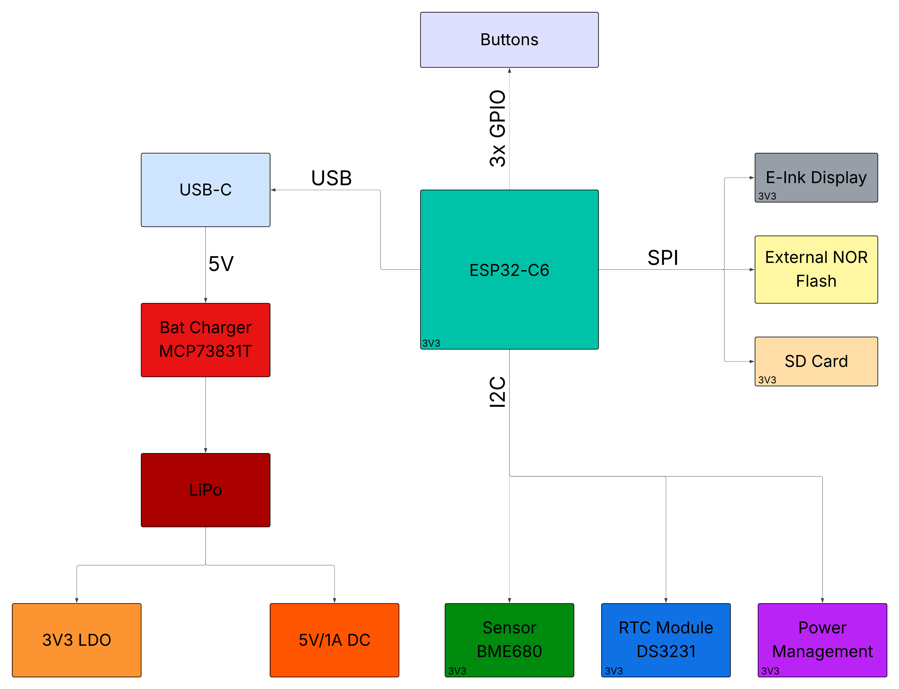

# 📖 OpenBook - Open-Source E-Book Reader

# Description
OpenBook is an open-source project aimed at developing an affordable and easily manufacturable e-book reader. This repository contains all the necessary hardware design files, including schematics, PCB layouts, 3D models, and manufacturing files.

#  Table of Contents

1. [📝 Description](#description)
2. [📜 Table of Contents](#table-of-contents)
3. [📂 Repository Contents](#repository-contents)
4. [🎯 Target Audience](#target-audience)
5. [🚀 Project Overview & Features](#project-overview--features)
6. [📊 E-Book Reader Diagram](#e-book-reader-diagram)
7. [📦 Bill of Materials (BOM)](#bill-of-materials-bom)
8. [🔧 Hardware Functionality Description](#hardware-functionality-description)
9. [🔌 Communication Interfaces](#communication-interfaces)
10. [⚡ Components and Estimated Power Consumption](#components-and-estimated-power-consumption)
11. [⚙️ ESP32-C6 Pin Usage Breakdown](#esp32-c6-pin-usage-breakdown)
12. [🛠️ Implementation Steps](#implementation-steps)
13. [🔧 Finalizing the Project](#finalizing-the-project)
14. [🖼️ Images](#images)

# Repository Contents
- 📡 **Schematic & PCB Design** → Circuit design files (`.sch`, `.brd`).
- 🏭 **Manufacturing Files** → Gerber files, Bill of Materials (BOM), Pick & Place files.
- 🏗️ **3D Model & Mechanical Design** → Full 3D assembly of the device, including PCB, battery, display, and casing.
- 📷 **Renders & Images** → Visual representations of the final device and PCB layout.
- 📜 **Documentation** → Detailed explanation of hardware architecture, component connections, and design decisions.

# Target Audience
This project is intended for hardware developers, electronics engineers, and open-source enthusiasts interested in PCB design, e-paper displays, and embedded systems.

## Project Overview & Features

### 📌 Project Goal
OpenBook aims to create an accessible and customizable open-source e-book reader that is affordable and easy to manufacture. By leveraging open hardware and software, we enable users to build and modify their own e-book readers while maintaining a low production cost.

### 🔹 Key Features
- **ESP32-C6 based** – Low-power microcontroller with Wi-Fi & Bluetooth connectivity.
- **E-paper Display** – Energy-efficient and easy on the eyes for long reading sessions.
- **Expandable Storage** – Supports microSD cards for storing a large collection of e-books.
- **USB-C Charging** – Modern and fast charging capability.
- **Open-Source Hardware** – Complete design files available for customization.
- **Compact and Lightweight** – Optimized design for portability and comfort.

### 🔧 System Architecture
The OpenBook device consists of four main components:
1. **PCB & Electronics** – The ESP32-C6 microcontroller, display driver, power management, and storage.
2. **E-paper Display Module** – A low-power display for efficient reading.
3. **Enclosure & Mechanical Design** – A 3D-printed or injection-molded case housing all components securely.
4. **Polymer Lithium-Ion Battery** – A rechargeable battery providing power to the device.

#  E-Book Reader Diagram

# Bill of Materials (BOM)

| 🔩 Component                                        | 🔗 Link                | 📄 Datasheet                        |
|--------------------------------------------------|-----------------------------------|-----------------------------------|
| ESP32-C6 WROOM-1-N8                              | [SnapMagic](https://www.snapeda.com/parts/ESP32-C6-WROOM-1-N8/Espressif+Systems/view-part/?ref=eda)         | [Datasheet](https://www.snapeda.com/parts/ESP32-C6-WROOM-1-N8/Espressif%20Systems/datasheet/)     |
| ESP32C6 Varistor 1812                            | [Mouser](https://ro.mouser.com/ProductDetail/EPCOS-TDK/B72520T0350K062?qs=dEfas%2FXlABIszF52uu7vrg%3D%3D)        | [Datasheet](https://www.tdk-electronics.tdk.com/inf/75/db/CTVS_14/Surge_protection_series.pdf)     |
| ESP32 WROVER 0805 Capacitor                      | [Mouser](https://ro.mouser.com/ProductDetail/KYOCERA-AVX/SD0805S020S1R0?qs=jCA%252BPfw4LHbpkAoSnwrdjw%3D%3D)         | [Datasheet](https://ro.mouser.com/datasheet/2/40/schottky-3165252.pdf)     |
| ESP32 WROVER BME680 Sensor                       | [SnapMagic](https://www.snapeda.com/parts/BME680/Bosch/view-part/?welcome=home)        | [Datasheet](https://www.snapeda.com/parts/BME680/Bosch%20Sensortec/datasheet/)     |
| ESP32 WROVER MCP73831 Power Management           | [Mouser](https://eu.mouser.com/ProductDetail/Microchip-Technology/MCP73831T-2ACI-OT?qs=yUQqVecv4qvbBQBGbHx0Mw%3D%3D)         | [Datasheet](https://eu.mouser.com/datasheet/2/268/MCP73831_Family_Data_Sheet_DS20001984H-3441711.pdf)     || ESP32 WROVER P-Channel MOSFET                    | [Component Search Engine](https://componentsearchengine.com/part-view/DMG2305UX-7/Diodes%20Incorporated)         | [Datasheet](https://www.diodes.com//assets/Datasheets/DMG2305UX.pdf)     |
| LED Chip 0603                                    | [SnapMagic](https://www.snapeda.com/parts/KP-1608SURCK/Kingbright/view-part/?ref=search&t=LED%200603)        | [Datasheet](https://www.snapeda.com/parts/KP-1608SURCK/Kingbright/datasheet/)     |
| SJ                                               | [GrabCad](https://grabcad.com/library/solder-jumpers-1)         | [Datasheet](https://www.youtube.com/watch?v=dQw4w9WgXcQ)     |
| LTSPICE Resistor 0402                            | [Component Search Engine](https://componentsearchengine.com/part-view/R0402%201%25%20100%20K%20(RC0402FR-07100KL)/YAGEO)        | [Datasheet](https://www.yageo.com/upload/media/product/products/datasheet/rchip/PYu-RC_Group_51_RoHS_L_12.pdf)     |
| RCL CPOL 3528                                    | [SnapMagic](https://www.snapeda.com/parts/TAJB475K025RNJ/AVX/view-part/?ref=dk&t=capacitor%203528&con_ref=None)        | [Datasheet](https://s3.amazonaws.com/snapeda/datasheet/TAJB475K025RNJ_AVX.pdf)     |
| 112A-TAAR-R03                                    | [Comet](https://store.comet.srl.ro/Catalogue/Product/43497/)         | [Datasheet](https://store.comet.bg/download-file.php?id=27596)     |
| Capacitor 0402                                   | [Component Search Engine](https://componentsearchengine.com/part-view/CC0402MRX5R5BB106/YAGEO)         | [Datasheet](https://componentsearchengine.com/Datasheets/2/CC0402MRX5R5BB106.pdf)     |
| 744043680 IND                                    | [Mouser](https://eu.mouser.com/ProductDetail/Wurth-Elektronik/744043680?qs=PGXP4M47uW6VkZq%252BkzjrHA%3D%3D)        | [Datasheet](https://www.we-online.com/components/products/datasheet/744043680.pdf)     |
| BD5229G-TR                                       | [Component Search Engine](https://componentsearchengine.com/part-view/BD5229G-TR/ROHM%20Semiconductor)         | [Datasheet](https://datasheet.datasheetarchive.com/originals/distributors/Datasheets_SAMA/f2b9741ef86007909f138d561a359946.pdf)     |
| Custom Button                                    | [Panasonic](https://industry.panasonic.com/global/en/products/control/switch/light-touch/number/evqpuj02k)        | [Datasheet](https://industry.panasonic.com/global/en/downloads?tab=catalog&small_g_cd=203&part_no=EVQPUJ02K&q=RVZRUFVKMDJLJTdDMTMlN0MyMDMlN0MzNDU5JTdDMSU3QyU3QzIlN0M%3D)     |
| CPH3225A                                         | [SnapMagic](https://www.snapeda.com/parts/CPH3225A/Seiko+Instruments/view-part/?ref=eda)         | [Datasheet](https://www.snapeda.com/parts/CPH3225A/Seiko%20Instruments/datasheet/)     |
| DS3231SN RTC                                     | [SnapMagic](https://www.snapeda.com/parts/DS3231SN%23/Analog+Devices/view-part/?ref=eda)        | [Datasheet](https://www.snapeda.com/parts/DS3231SN%23/Analog%20Devices/datasheet/)     |
| FH34SRJ-24S-0.5SH Connector                      | [Component Search Engine](https://componentsearchengine.com/part-view/FH34SRJ-24S-0.5SH(99)/Hirose)        | [Datasheet](https://www.hirose.com/en/product/document?clcode=CL0580-1255-6-99&productname=FH34SRJ-24S-0.5SH(99)&series=FH34SRJ&documenttype=2DDrawing&lang=en&documentid=0000990903)     |
| MAX17048G+T10 Battery Fuel Gauge                 | [SnapMagic](https://www.snapeda.com/parts/MAX17048G+T10/Analog+Devices/view-part/?ref=eda)         | [Datasheet](https://www.snapeda.com/parts/MAX17048G+T10/Analog%20Devices/datasheet/)     |
| MBR0530 Schottky Diode                           | [SnapMagic](https://www.snapeda.com/parts/MBR0530/Onsemi/view-part/?ref=eda)        | [Datasheet](https://www.snapeda.com/parts/MBR0530/ON%20Semiconductor/datasheet/)     |
| PGB1010603MR Inductor                            | [SnapMagic](https://www.snapeda.com/parts/PGB1010603MR/Littelfuse/view-part/?ref=eda)         | [Datasheet](https://www.snapeda.com/parts/PGB1010603MR/Littelfuse%20Inc./datasheet/)     |
| QWIIC Connector                                  | [Mouser](https://eu.mouser.com/ProductDetail/Adafruit/4208?qs=PzGy0jfpSMtbScLbr0L5dw%3D%3D)        | [Datasheet](https://www.youtube.com/watch?v=dQw4w9WgXcQ)     |
| USB4110-GF-A USB Hub                             | [Component Search Engine](https://componentsearchengine.com/part-view/USB4110-GF-A/GCT%20(GLOBAL%20CONNECTOR%20TECHNOLOGY))         | [Datasheet](https://gct.co/files/drawings/usb4110.pdf)     |
| SI1308EDL-T1-GE3 MOSFET                          | [SnapMagic](https://www.snapeda.com/parts/SI1308EDL-T1-GE3/Vishay+Siliconix/view-part/?ref=eda)        | [Datasheet](https://www.youtube.com/watch?v=dQw4w9WgXcQ)     |
| TPTP20R                                          | [Comet](https://easyeda.com/component/7524403feb2642ac9f9f26dfb93ceacf)         | [Datasheet](https://easyeda.com/component/7524403feb2642ac9f9f26dfb93ceacf)     |
| USBLC6-2SC6Y USB Surge Protection                | [SnapMagic](https://www.snapeda.com/parts/USBLC6-2SC6Y/STMicroelectronics/view-part/?ref=eda)        | [Datasheet](https://www.snapeda.com/parts/USBLC6-2SC6Y/STMicroelectronics/datasheet/)     |
| W25Q512JVEIQ Flash Memory                        | [SnapMagic](https://www.snapeda.com/parts/W25Q512JVEIQ/Winbond+Electronics/view-part/?ref=eda)         | [Datasheet](https://www.snapeda.com/parts/W25Q512JVEIQ/Winbond%20Electronics/datasheet/)     |
| XC6220A331MR-G Voltage Regulator                 | [Component Search Engine](https://componentsearchengine.com/part-view/XC6220A331MR-G/Torex)        | [Datasheet](https://product.torexsemi.com/system/files/series/xc6220.pdf)     |

# Hardware Functionality Description

## 1. 🔋 **Battery:**
   - **Model:** CELLEVIA BATTERIES LP584174
   - **Specifications:** 3.7V, 1800mAh
   - **Functionality:** Provides stable power for the entire device. The Li-Po battery is charged and monitored by a dedicated controller, ensuring longer battery life and protection against overcharging and deep discharge.

## 2. 🖥️ **E-Paper Display:**
   - **Model:** 7.5” e-Paper V2
   - **Revision:** 2.0 (2019/06/28)
   - **Functionality:** The e-paper display allows for extremely low power consumption, making it ideal for long-term text reading. It is controlled via an SPI interface and powered by an LDO (Low Dropout Regulator).

## 3. 🧠 **ESP32 C6:**
   - **Functionality:** The main microcontroller of the device, responsible for managing all hardware functions and communication between internal components. It connects to the display, sensors, SD card, external flash, and other peripheral modules.

## 4. 🌍 **Environmental Sensor BME688:**
   - **Interface:** I2C
   - **Functionality:** Measures temperature, humidity, pressure, and air quality. It provides environmental information and can contribute to adjusting the device's behavior based on the surrounding conditions.

## 5. ⏰ **RTC (Real-Time Clock) - DS3231SN:**
   - **Interface:** I2C
   - **Functionality:** Keeps accurate time and date even when the device is turned off. It is essential for synchronizing any time-related activities (e.g., saving progress or scheduling device wake-up).

## 6. ⚡ **Li-Po Charging Controller (MCP73831T):**
   - **Interface:** USB-C
   - **Functionality:** This module regulates the charging of the Li-Po battery, ensuring protection against overcharging and deep discharge. It is powered through the USB-C connector, which enables fast charging.

## 7. 💾 **SD Card Module:**
   - **Interface:** SPI
   - **Functionality:** Allows for the storage of files, including e-book documents, on an external SD card. This is essential for managing the reading files.

## 8. 🧠 **External NOR Flash 64MB:**
   - **Interface:** SPI
   - **Functionality:** Provides additional storage for the application files and device data.

## 9. 🛠️ **Test Pads and Qwiic/Stemma QT:**
   - **Functionality:** Test pads are used for debugging and testing, while the Qwiic/Stemma QT connectors enable easy addition of new modules through I2C or SPI interfaces.

## 10. 💡 **LDO Voltage Regulator:**
   - **Functionality:** Ensures a constant voltage supply to all modules, protecting them from input voltage fluctuations.

---

##  Communication Interfaces
   - **🟢 GPIO:** Used for managing physical buttons (e.g., reset button, power button).
   - **🔌 USB-C:** Enables battery charging and connection to a PC for data transfer.
   - **🔄 I2C:** Used for communication with the 🛰️ BME688 sensor and ⏰ DS3231SN RTC module.
   - **⚡ SPI:** Used to connect to the 💾 SD card, 📜 e-paper display, and 🔥 external flash, enabling fast data transfer.

#  Components and Estimated Power Consumption

Now that we have detailed the components of the project, we can approximate the energy consumption based on typical values for each component.

## 🔋 Components and Estimated Power Consumption

### 1️⃣ **Polymer Lithium-Ion Battery (CELLEVIA BATTERIES LP584174)**
   - **🔋 Voltage:** 3.7V  
   - **⚡ Capacity:** 1800mAh  
   - **⏳ Battery Life:** Depends on total consumption, but with a capacity of 1800mAh, the battery could power the device for several hours.

### 2️⃣ **ESP32 C6 (Main Processor)**
   - The ESP32 C6 has variable power consumption depending on usage:
     - 💤 **Idle mode:** ~0.1mA  
     - 📡 **Wi-Fi active:** ~200mA  
     - 🔵 **Bluetooth active:** ~150mA  
     - 🚀 **Max (under heavy load, e.g., during communication):** ~350mA  

   - **⚡ Assumed average consumption:** **150mA**

### 3️⃣ **📜 7.5” E-Paper Display**
   - **Typical consumption:** 30-50mA during screen updates (very low power when idle).
   - Assuming updates happen a few times per hour, an average consumption of **40mA** can be expected.

### 4️⃣ **🛰️ Environmental Sensor BME688**
   - **Typical consumption:** 2-3mA during measurement.
   - We estimate **2mA** for the BME688 sensor.

### 5️⃣ **⏰ RTC Module DS3231SN**
   - **Typical consumption:** 1-2mA
   - Assuming an active mode, we estimate **2mA**.

### 6️⃣ **🔄 Li-Po Battery Charging Controller (MCP73831T)**
   - **Power consumption:** Minimal during charging, so it is **negligible** for this estimate.

### 7️⃣ **💾 SD Card**
   - **Typical consumption:** 10-15mA during data access.
   - We estimate **12mA** for the SD card.

### 8️⃣ **🔥 External NOR Flash (64MB)**
   - **Typical consumption:** 20-30mA when reading data, lower in standby mode.
   - We estimate **25mA** for active usage.

---

## 📊 Total Power Consumption Estimation (Typical Configuration)

Assuming the ESP32 is continuously active with Wi-Fi, the e-paper display updates every 10 seconds, and the BME688 sensor is continuously measuring.

| ⚙️ Component                        | ⚡ Consumption (mA) |
|--------------------------------------|---------------------|
| 📡 **ESP32 C6 (Wi-Fi active)**       | 200mA              |
| 📜 **E-Paper Display (Updating)**    | 40mA               |
| 🛰️ **BME688 Sensor (measuring)**    | 2mA                |
| ⏰ **RTC Module (active)**           | 2mA                |
| 💾 **SD Card (in use)**              | 12mA               |
| 🔥 **External NOR Flash**            | 25mA               |

### ✅ **Total Consumption (Typical Use):**
⚡ **200mA** (ESP32) + **40mA** (Display) + **2mA** (BME688) + **2mA** (RTC) + **12mA** (SD Card) + **25mA** (NOR Flash) = **281mA**

---

## ⏳ **Estimating Battery Life**

Given that the battery has a capacity of **1800mAh**, and assuming a typical consumption of **281mA**, we can estimate the battery life:

📏 **Battery Life Calculation:**  
`Battery Life = Battery Capacity / Average Consumption`  
`Battery Life = 1800mAh / 281mA ≈ 6.41 hours`

## 📢 **Conclusion**

Under continuous usage (**Wi-Fi active, periodic e-paper updates, and sensor readings**), the estimated battery life is **~6.4 hours**. However, real-world performance may vary due to:

- 🔋 **Power-saving optimizations** (e.g., deep sleep mode on ESP32)  
- 🔄 **Lower update frequency for e-paper display**  
- 📡 **Disabling Wi-Fi/Bluetooth when not needed**  

For **longer battery life**, optimizing power consumption by using sleep modes, reducing display updates, and minimizing SD card writes will be crucial. 🚀🔋

# ESP32-C6 Pin Usage Breakdown

## 🔋 Power Connections
- **3V3 (Pin 2 & Top Right)** → Provides 3.3V power to the ESP32-C6 and connected components.
- **GND (Bottom Right)** → Ground connection for the circuit.

## 🔄 Boot and Reset Control
- **GPIO8 (Pin 15, IO/BOOT)** → Used for boot mode selection. Pulled down via a 10KΩ resistor.
- **RESET (Pin 3)** → Manual reset pin.

## 🔗 SPI Interface (For E-Paper Display & Flash)
- **MISO (Pin 27)** → Master-In Slave-Out, used for reading data from peripherals like the E-Paper Display.
- **MOSI (Pin 10)** → Master-Out Slave-In, used for sending data to peripherals.
- **SCK (Pin 7)** → Serial Clock, used for synchronizing SPI communication.
- **SS_SD (Pin 4)** → Likely used as a chip select (CS) for an SD card or another SPI peripheral.
- **EPD_CS (Pin 11)** → Chip select for the E-Paper Display.
- **FLASH_CS (Pin 12)** → Chip select for external Flash memory.

## 🖥️ E-Paper Display Control Signals
- **EPD_BUSY (Pin 26)** → Indicates when the E-Paper Display is busy.
- **EPD_DC (Pin 5)** → Data/Command control for the E-Paper Display.
- **EPD_RST (Pin 21)** → Reset pin for the E-Paper Display.
- **EPD_3V3_C (Pin 19)** → Likely an enable pin for EPD power.

## 📡 I2C Interface (For RTC and Sensors)
- **SDA (Pin 20)** → Data line for I2C communication.
- **SCL (Pin 21)** → Clock line for I2C communication.
- **I2C_PW (Pin 18)** → Likely a power enable signal for I2C devices.
- **INT_RTC (Pin 8)** → Interrupt signal from the RTC module.
- **RTC_RST (Pin 16)** → Reset line for the RTC module.

## 🔌 USB Communication
- **USB_D- (Pin 13)** & **USB_D+ (Pin 14)** → Differential data lines for USB communication.

## 📶 Serial Communication (UART)
- **TX (Pin 25)** → UART transmit pin.
- **RX (Pin 24)** → UART receive pin.

## ⚙️ Other GPIO Assignments
- **IO_CHANGE (Pin 23)** → Might be used as an interrupt or status pin for external components.

---

### 🛠️ Why These Pins?
This pin selection follows these principles:
- **SPI pins** (MISO, MOSI, SCK, CS) handle high-speed communication with the E-Paper Display and Flash.
- **I2C pins** (SDA, SCL) facilitate low-speed communication with sensors (RTC & environmental sensor).
- **Dedicated control pins** (EPD_BUSY, EPD_DC, etc.) ensure efficient E-Paper operation.
- **UART pins** (TX, RX) enable debugging or external serial communication.

This setup ensures proper functionality and efficient communication between components. Let me know if you need clarifications! 🚀

#  Implementation Steps  

## 🔧 Step 1: Component Placement and Schematic  
The first step was to place the components on the PCB and connect them according to the provided schematic. This step was crucial to ensure that all the components were correctly positioned and interconnected.  

## 📐 Step 2: PCB Layout and Compatibility with Case  
Once the components were placed, the second step was to arrange them on the PCB layout to fit the given casing. I made sure that the connectors and pins aligned properly with the case's openings for ports and buttons.  

## 🔌 Step 3: Routing the Connections  
The third step involved routing the connections between the components (wires), where I encountered my first challenge. Due to suboptimal component placement, I had to route some power lines using vias, which were also routed on the bottom layer of the PCB. Additionally, I used a relatively large number of vias. However, as an engineer, I recognized that things don't need to be perfect, so I moved forward with the process, compensating with extra attention to detail in later steps.  

## 🖥️ Step 4: 3D Models for Each Component  
With the electrical schematic and PCB layout complete, the next step was to import and attach 3D models for each component. I sourced the models from various platforms, such as SnapMagic, Mouser, Comet, Component Search Engine, etc. These models helped visualize how the components would fit together in the final product.  

## 🔋 Step 5: Battery and Display 3D Design  
At this point, I used the datasheet for the **Polymer Lithium-Ion Battery (CELLEVIA BATTERIES LP584174)** to create its 3D model for the PCB. Similarly, I applied the same process for the **7.5-inch e-Paper V2 display**, ensuring both components were accurately represented in the 3D design.  

## 🏗️ Step 6: Final Design Assembly  
With the 3D PCB design complete, along with all components in place, I moved on to assembling the full design of the **E-Book Reader**. This included the **PCB, battery, display, and casing**, resulting in the final product design.  

# Finalizing the Project  

To complete the entire project, I had to add the following files:  

## 🛠️ Hardware  
  - **📜 Schematic File (.sch)** - The electronic circuit diagram.  
  - **📏 Board File (.brd)** - The PCB layout with routed connections.  

## 🏭 Manufacturing  
  - **📂 Gerbers.zip** - Files for PCB fabrication.  
  - **📋 Bill of Materials File (.csv)** - List of components used.  
  - **📌 Pick and Place File (.csv)** - Component placement data for assembly.  

## 🎨 Mechanical  
  - **📎 3D File of the Complete Device (.step)** - Exploded view of the full assembly.  
  - **🖌️ 3D Fusion360 File** - Editable 3D model of the device.  

## 🖼️ Images  
  - **📸 Rendered Images** - High-quality visuals of the PCB and device.  

## 📄 Additional Files  
  - **📝 LICENSE** - GNU GENERAL PUBLIC LICENSE 2007.  
  - **📖 README.md** - Project documentation and implementation steps.  

# Images  

## 🎯 Final Product  
  
